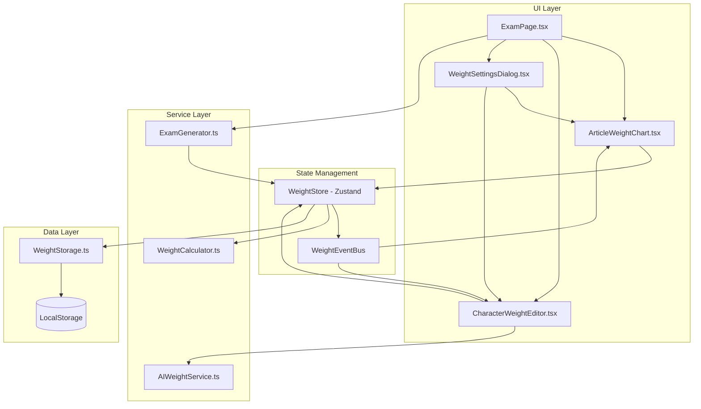
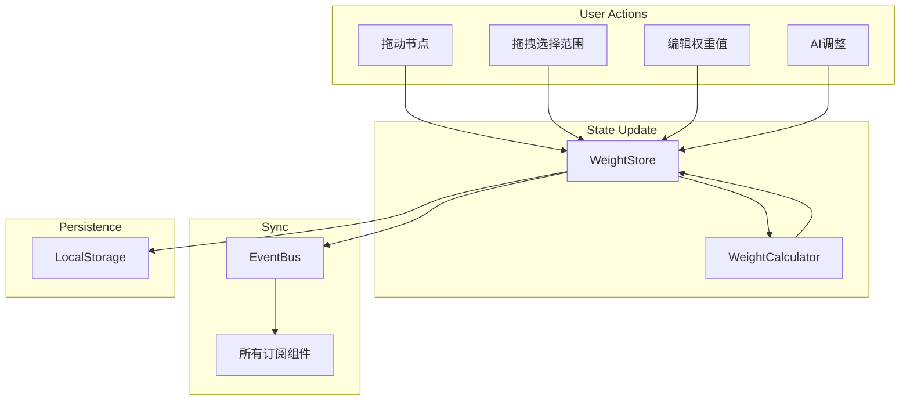
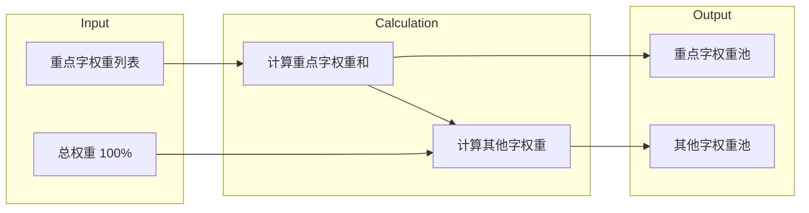

# Design Document

## Overview

本设计文档描述自动出题功能全面升级的技术实现方案。主要包括以下核心改进：

1. **考察范围选择器改造** - 将传统的下拉选择器改造为动态图表形式，支持拖拽选择文章范围和可视化权重调整
2. **加权随机系统整合** - 统一管理文章、义项、考察字的加权数据，实现多组件间的数据同步
3. **AI加权功能改进** - 支持单个和批量AI权重调整
4. **重点字加权系统** - 实现100%总权重分配机制，支持重点字和"其他字"的权重管理
5. **实时可视化反馈** - 提供直观的权重编辑体验和状态显示

## Architecture



## Components and Interfaces

### 1. 统一权重配置接口

```typescript
// 文章权重
export interface ArticleWeight {
  articleId: string;
  articleTitle: string;
  collectionId: string;
  collectionName: string;
  weight: number;      // 0-100
  included: boolean;   // 是否包含在考察范围
  order: number;       // 显示顺序
}

// 重点字权重
export interface CharacterWeight {
  char: string;
  weight: number;      // 0-100，该字在重点字池中的权重
}

// 统一权重配置
export interface UnifiedWeightConfig {
  id: string;
  name: string;
  note?: string;
  
  // 文章权重配置
  articleWeights: ArticleWeight[];
  
  // 重点字权重配置
  characterWeights: CharacterWeight[];
  otherCharactersWeight: number;  // 其他字的权重（0-100）
  
  createdAt: string;
  updatedAt: string;
}
```

### 2. 权重状态管理 (Zustand Store)

```typescript
export interface WeightState {
  // 当前配置
  currentConfig: UnifiedWeightConfig | null;
  
  // 文章权重操作
  setArticleWeight: (articleId: string, weight: number) => void;
  setArticleIncluded: (articleId: string, included: boolean) => void;
  setArticleRange: (startIndex: number, endIndex: number) => void;
  
  // 重点字权重操作
  addCharacter: (char: string, weight: number) => void;
  removeCharacter: (char: string) => void;
  setCharacterWeight: (char: string, weight: number) => void;
  setOtherCharactersWeight: (weight: number) => void;
  
  // 配置管理
  loadConfig: (config: UnifiedWeightConfig) => void;
  saveConfig: (name: string, note?: string) => void;
  resetConfig: () => void;
  
  // 订阅机制
  subscribe: (listener: (state: WeightState) => void) => () => void;
}
```

### 3. 动态图表组件接口

```typescript
export interface ArticleWeightChartProps {
  articles: ArticleWeight[];
  onWeightChange: (articleId: string, weight: number) => void;
  onRangeSelect: (startIndex: number, endIndex: number) => void;
  onArticleToggle: (articleId: string, included: boolean) => void;
  readonly?: boolean;
}

export interface ChartNode {
  x: number;           // 横轴位置
  y: number;           // 纵轴位置（权重值）
  articleId: string;
  articleTitle: string;
  weight: number;
  included: boolean;
}

export interface ChartCurve {
  points: { x: number; y: number }[];
  color: string;
}
```

### 4. AI权重调整接口

```typescript
export interface AIWeightRequest {
  type: 'single' | 'batch';
  targetId?: string;           // 单个调整时的目标ID
  context: {
    articleWeights?: ArticleWeight[];
    characterWeights?: CharacterWeight[];
    scope?: ExamScope;
  };
  requirement?: string;        // 用户需求描述
}

export interface AIWeightResult {
  suggestions: {
    id: string;
    currentWeight: number;
    suggestedWeight: number;
    reason: string;
  }[];
  overallReasoning: string;
}

export interface AIWeightService {
  adjustWeight(request: AIWeightRequest): Promise<AIWeightResult>;
}
```

### 5. 权重计算器接口

```typescript
export interface WeightCalculator {
  // 计算其他字的剩余权重
  calculateOtherCharactersWeight(characterWeights: CharacterWeight[]): number;
  
  // 验证权重配置
  validateWeights(config: UnifiedWeightConfig): ValidationResult;
  
  // 根据权重选择字符
  selectCharacterByWeight(
    characterWeights: CharacterWeight[],
    otherCharactersWeight: number,
    availableChars: string[]
  ): string;
  
  // 计算题目分配
  calculateQuestionDistribution(
    totalQuestions: number,
    characterWeights: CharacterWeight[],
    otherCharactersWeight: number
  ): { priorityCount: number; otherCount: number };
}

export interface ValidationResult {
  isValid: boolean;
  warnings: string[];
  errors: string[];
}
```

## Data Models

### 权重数据流



### 重点字权重计算模型



## Correctness Properties

*A property is a characteristic or behavior that should hold true across all valid executions of a system-essentially, a formal statement about what the system should do. 
Properties serve as the bridge between human-readable specifications and machine-verifiable correctness guarantees.*

### Property 1: 拖拽范围选择正确性

*For any* 文章列表和任意的起始索引、结束索引，拖拽选择后被包含的文章应该恰好是该索引范围内的所有文章。

**Validates: Requirements 1.2**

### Property 2: 权重更新一致性

*For any* 文章和新的权重值，更新操作后该文章的权重应该等于设置的新值，且其他文章的权重保持不变。

**Validates: Requirements 1.3, 1.4, 1.5**

### Property 3: 双向数据同步

*For any* 权重修改操作（无论来自加权设置对话框还是自动出题页面），修改后两个编辑器显示的数据应该完全一致。

**Validates: Requirements 2.2, 2.3**

### Property 4: 权重配置序列化Round-Trip

*For any* 有效的权重配置，序列化为JSON后再反序列化应该得到与原配置相等的配置对象。

**Validates: Requirements 2.4, 2.5, 7.3, 7.4**

### Property 5: AI请求参数完整性

*For any* AI权重调整请求（单个或批量），发送给AI的请求应该包含完整的上下文信息（当前权重配置、考察范围等）。

**Validates: Requirements 3.1, 3.2**

### Property 6: AI结果应用正确性

*For any* AI返回的权重建议，用户确认后对应选项的权重应该更新为建议值，未涉及的选项权重保持不变。

**Validates: Requirements 3.3, 3.4**

### Property 7: AI错误处理保持原值

*For any* AI调整请求失败的情况，所有权重值应该保持与请求前完全相同。

**Validates: Requirements 3.5**

### Property 8: 重点字权重自动计算

*For any* 重点字权重配置，"其他字"的权重应该等于 100 减去所有重点字权重之和。当重点字权重总和达到100时，"其他字"权重应该自动变为0。

**Validates: Requirements 4.2, 4.3, 4.5**

### Property 9: 仅重点字出题

*For any* "其他字"权重为0的配置，生成的所有题目中考察的字符应该全部来自重点字列表。

**Validates: Requirements 4.4**

### Property 10: 题目分配比例

*For any* 权重配置和题目数量，生成的题目中重点字题目数量与其他字题目数量的比例应该接近其权重比例。当重点字数量不足时，多余的题目应该由其他字补充。

**Validates: Requirements 5.1, 5.2, 5.3**

### Property 11: 数据不足错误处理

*For any* "其他字"权重为0且重点字数量不足以生成指定数量题目的情况，系统应该抛出包含明确原因的错误。

**Validates: Requirements 5.4**

### Property 12: 权重显示完整性

*For any* 权重配置，显示的信息应该包含每项的百分比值，且所有百分比之和应该等于100%（或显示警告）。

**Validates: Requirements 6.2, 6.3**

### Property 13: 统一权重计算模型

*For any* 权重修改操作，系统应该通过统一的计算模型重新计算所有相关权重，确保数据一致性。

**Validates: Requirements 7.1**

## Error Handling

### 权重配置错误

| 错误场景 | 错误信息 | 处理方式 |
|---------|---------|---------|
| 权重总和超过100% | "权重总和超过100%，请调整各项权重" | 显示警告，标记异常项 |
| 权重值为负数 | "权重值不能为负数" | 阻止输入，显示提示 |
| 无选中文章 | "请至少选择一篇文章" | 禁用生成按钮 |

### 数据不足错误

| 错误场景 | 错误信息 | 处理方式 |
|---------|---------|---------|
| 重点字不足 | "重点字数量不足以生成{n}道题目（当前可生成{m}道）" | 显示具体数量，建议调整 |
| 其他字为0且重点字不足 | "数据不足：其他字权重为0，但重点字只能生成{m}道题" | 建议增加其他字权重或减少题目数 |

### AI服务错误

| 错误场景 | 错误信息 | 处理方式 |
|---------|---------|---------|
| API调用失败 | "AI服务调用失败：{具体错误}" | 保持原值，允许重试 |
| 配置无效 | "当前AI配置无效，请检查API Key" | 引导用户检查配置 |
| 响应解析失败 | "AI响应格式错误" | 保持原值，显示错误详情 |

## Testing Strategy

### 单元测试

1. **权重计算器测试**
   - 测试 `calculateOtherCharactersWeight` 方法
   - 测试 `validateWeights` 方法
   - 测试 `selectCharacterByWeight` 方法
   - 测试 `calculateQuestionDistribution` 方法

2. **权重状态管理测试**
   - 测试状态更新操作
   - 测试订阅机制
   - 测试配置加载/保存

3. **序列化测试**
   - 测试JSON序列化/反序列化
   - 测试边界值处理

### 属性测试

使用 fast-check 库进行属性测试：

1. **范围选择属性测试**
   - 生成随机的文章列表和索引范围
   - 验证选择结果的正确性

2. **权重计算属性测试**
   - 生成随机的权重配置
   - 验证计算结果的一致性

3. **序列化Round-Trip测试**
   - 生成随机的权重配置
   - 验证序列化后反序列化的等价性

4. **题目分配属性测试**
   - 生成随机的权重配置和题目数量
   - 验证分配比例的正确性

### 测试标注格式

每个属性测试必须使用以下格式标注：
```typescript
// **Feature: exam-upgrade, Property {number}: {property_text}**
```

### 测试配置

- 属性测试最少运行100次迭代
- 使用 vitest 作为测试框架
- 使用 fast-check 作为属性测试库
